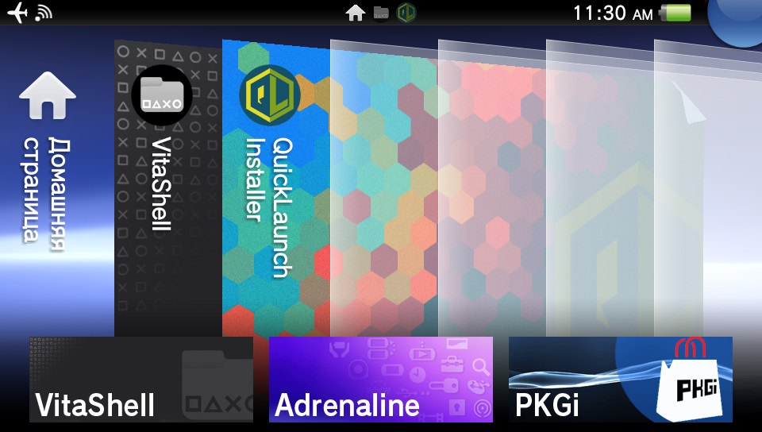

# QuickLaunch Installer for PS Vita

** About **

This tool installs custom shortcuts to multitasking menu (push PS button on LiveArea) on HomeBrew enabled PS Vita.

Default shortcuts for installation:
- VitaShell
- Adrenaline v6+
- PKGi

** Multilanguage support **

QL installer does automatically load the language that matches to the current system language. If your system language is for example russian, it will load from 'ux0:data/qlinstall/lang/russian.txt'.

Please use ux0:data/qlinstall/lang/english_us.txt as base to make your translations.

Also you can use custom .ttf font specific to your language. Just put it to ux0:data/qlinstall/resources/%language%.ttf

File naming for translations *.txt and fonts *.ttf:

japanese

english_us

french

spanish

german

italian

dutch

portuguese

russian

korean

chinese_t

chinese_s

finnish

swedish

danish

norwegian

polish

portuguese_br

turkish

If your translation doesnt loading automaticly, it can miss some strings, so check actual english_us.txt to fix it.

If you have incorrect width of default font chars, try to use russian.ttf as custom font and rename to %language%.ttf it may fix problem with cyrillic languages.

Please report me if it helps and your language, I'll make needed font loading automatic.

Also you can add you custom translation to my repo, just fork it and add your translation to "translations" folder and make pull request.

** Todo: **

- Optimize specific font loading translations 
- Add support for userfriendly custom shortcuts installation.

** Thx **

- App created with LUA and based on sources by Team OneLua. https://github.com/ONElua/

lupus
